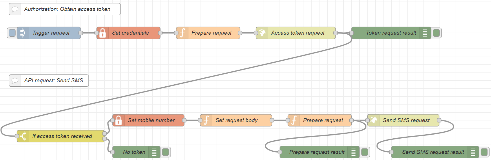

# Introduction

The KPN SMS API allows you to send SMS, using a simple HTTP-based API.

The good news is, interacting with this API just got easier with Node-RED flows. Flows are individual programs that are build with Node-RED. They consist of several nodes which perform a single task on a `msg.object` that is passed down the flow. They are easy to create and there are a lot of free nodes and flows available.

**What is Node-RED**

Node-RED is a programming tool for wiring together hardware devices, APIs and online services in new and interesting ways. It is based on Node.js. It provides a browser-based editor that helps you to wire together flows using the wide range of nodes in the palette that can be deployed to its runtime in a single-click.

**What will you lean**

You will build a flow consisting of two parts:

1. In the first part flow you obtain an access token from the KPN Authorization API (OAuth flow).
2. In the second and you send an SMS using the `POST /send` endpoint of the KPN SMS API.

If you don't want to build the flow yourself you can download it directly from GitHub and import it into you own Node-RED environment. 

[Download the flow from GitHub](https://github.com/kpnapistore/SMS-KPN/tree/master/Tutorials/Send_SMS_with-Node-RED/node-red_KPN-SMS-flows.json)


## Overview

<!--a /a-->



</br>

## Prerequisites

Before getting started, you’ll need a few things installed on your machine:

* Node.js
* Node-RED
* the `node-red-contrib-credentials` package

</br>

## Setting up your Node-RED editor

First, you’ll need to install the runtime and editor. This could be done either on your local machine, or a number of cloud-hosted options. This tutorial will be using your local machine, so once you’ve installed Node-RED locally, just type the command below in your terminal to get started.

</br>

## Starting the flow

Open a terminal, GitBash, PowerShell or the like and type `node-red`.

```sh
C:\Users\ABC> node-red

Server now running at http://127.0.0.1:1880/
```

You can then access the Node-RED editor by pointing your browser at `http://localhost:1880`.

</br>

## Installing the credentials node

To make our life easier and the storage of your credentials more secure we have to install a credentials node. We could do the same with variables but this way is more elegant.
Once you have your editor open, you’ll need to go to the Manage palette menu, and search for the  `node-red-contrib-credentials` package. When you have found it, click Install.
You will find the `credentials` node in the palette under the storage group.

</br>

## Import the tutorial flow

You can download the complete flow from GitHub and import it into your Node-Red editor. 

* [Download the flow from GitHub](https://github.com/kpnapistore/SMS-KPN/tree/master/Tutorials/Send_SMS_with-Node-RED/node-red_KPN-SMS-flows.json) and save it on your machine.
* In the Node-RED editor, go to the menu, and select `Import`.
* In the Import window, click on `select a file to import`. 
* Select the downloaded file `node-red_KPN-SMS-flows.json` and click `Open`.
* Select `Import to new  flow`, and click `Import`.
  
The flow is imported into a new editor tab.

</br>

## Using nodes

For the OAuth flow to obtain an access token you'll need the following nodes:

1. `inject`
2. `credentials`
3. `function`
4. `http request`
5. `debug`

For the Send SMS flow you'll need the following nodes:

1. `switch`
2. `change`
3. `function`
4. `http request`
5. `debug`

**Note**: The `inject` node has a blue button on the left. Use it to manually trigger a request. The `debug` node has a green button on the right. Use it to deactivate and activate debugging. Sometimes you just want to see less messages in the debug window.

</br>

## Obtaining an access token (Authorization flow)

First things first. To use KPN APIs, you must obtain an access token (also called bearer token). The access token is obtained by invoking an Authorization API using a `POST` method. The payload of the API request is an object with your KPN API Store credentials:

* `client_id`
* `client_secret`

If correct, the API returns a payload object that contains a valid access token that you can use in subsequent API requests.

### Adding an inject node

First, drag the `inject` node to the flow editor. This node can inject a message into a flow either manually or at regular intervals. The message payload can be a variety of types, including strings, JavaScript objects or the current time.

The idea is to use the `inject` node to manually trigger requests. The credentials will be send to the `function` node, where we configure the API request. The `http request` actually performs the request with the information from the previous nodes. The `debug` node (you can use as many you like) provide information in case something is not quite right.

</br>

### Storing your client credentials

To avoid storing your My API Store credentials in the code of the request you can use this node to store your credentials. Drag the `credentials` node to the flow editor and double-click on it.

Define two values:

</br>

Value | private | to
---------|----------|---------
 Value 1|  `msg.client_id` | Paste your `client_id` from My API Store.
 Value 2 | `msg.client_secret` | Paste your `client_secret` from My API Store.

 </br>

Set `Name` to a distinctive name, for example: `KPN API Store credentials`. Click **Done** when you have finished.

Connect the `inject` node with the `credentials` node.

</br>

### Preparing the request in a function node

In this step you'll use the `function` node that allows JavaScript code to be run against the messages that are passed through it.

Drag the `function` node to the flow editor and double-click on it.

Copy the following code into the `Function` tab of the node.

1. Set `Name` to a distinctive name, for example: `Prepare request`.
2. Copy and paste the following code snippet into the `Function` tab of the node.
3. Click **Done** when you have finished.

```js
// Sets the `loginAPI` API URL, the method and the headers:

var loginAPI = "https://api-prd.kpn.com/oauth/client_credential/accesstoken?grant_type=client_credentials";

msg.method = "POST";
msg.url = loginAPI;
msg.headers = {};
msg.headers["Content-Type"] = "application/x-www-form-urlencoded";

// Fetches your `client_id` and `client_secret` from the `credentials` node.

msg.payload = 'client_id=' + msg.client_id + '&client_secret=' + msg.client_secret;
return msg;
```

Then connect the `credentials` node with the `function` node.

</br>

### Configuring the OAuth request

Drag a `http request` node to the flow editor and double-click on it. The `http request` node sends HTTP requests and returns the response.

1. Set `Name` to a distinctive name, for example: `Access token request`.
2. Set `Method` to `- set by msg.method`.
3. Leave `URL` as it is.
4. Set `Return` to `a parsed JSON object`.
5. Click **Done** when you have finished.

Then connect the `function` node with the `http request` node.

</br>

### Adding a debug node

To find out if the flow is working or to investigate errors you'll use `debug` nodes. These display selected message properties in the debug sidebar tab.

Drag a `debug` node to the flow editor and double-click on it.

1. Set `Name` to a distinctive name, for example: `Token request result`.
2. Set the `Output` to `complete msg object`.
3. Set `To` to `Debug window`.
4. Click **Done** when you have finished.

Then connect the `http request` node with the `debug` node.

Click `Deploy`. The OAuth access token request flow is now complete.  

To test the flow, click on the blue button of the `inject node`.

If the flow is correct, the `debug` node will return a 200 in the debug sidebar tab. If not it will provide an error message that allows you to investigate further.

</br>

## Configuring the Send SMS request flow

Now you you have a working Authorization flow that allows you to obtain and re-use an access token, you can start creating the flow to send a SMS.

</br>

### Setting up the switch node

Drag the following nodes to the flow editor: `switch`, `change`, and `debug`.

Double-click on the `switch` node. You'll use the switch to route messages based on their property values.

1. Set `Name` to a distinctive name, for example: `If access token received`.
2. Set `Property` to `msg.StatusCode`.
3. Set the first rule to `==`, `string`. As value, use `200`.
4. Set second rule to  `otherwise`.
5. Click **Done** when you have finished.

Now connect the `switch` node to the `change` node and to a `debug` node.

</br>

### Preparing the request body

Now you'll have to add payload to the request. You can do this in a `change` node and add a some JSON code. Change nodes can set, change, delete or move properties of a message, flow context or global context.

Drag a `change` node to the flow editor and double-click on it:

1. Set `Name` to a distinctive name, for example: `Set request body`.
2. In Rules, select `Set` and `msg.json`.
3. In `to`, select `{} JSON` and then click the three dots (`...`) on the right.
4. Copy and paste the following code snippet into the `Edit JSON` tab of the node.
5. Enter the mobile number of the recipient and the message content.
6. Click **Done** when you have finished.

```json
{
    "sender": "KPN API",
    "messages": [
        {
            "mobile_number": "06xxxxxxx",
            "content": "Add the content of the message."
        }
    ]
}
```

</br>

### Configuring the function node

You'll use another  `function` node to authenticate with the `Send` endpoint of the API.

Drag a `function` node to the flow editor and double-click on it:

1. Set `Name` to a distinctive name, for example: `Prepare request`.
2. Copy and paste the following code snippet into the `Function` tab of the node.
3. Click **Done** when you have finished.

```javascript
var aggURL = "https://api-prd.kpn.com/messaging/sms-kpn/v1/send";
var apiName = "";

msg.method = "POST";
msg.url = aggURL + apiName;
msg.headers = {};
msg.headers.Authorization = "Bearer " + msg.payload.access_token;
msg.headers["Content-Type"] = "application/json";
//msg.payload = null;
msg.payload = msg.json;
return msg;
```

</br>

Then connect the `change` node from the previous step with the `function` node and add another `debug` node if you like.

</br>

### Configuring Send SMS request

The `http request` node sends HTTP requests and returns the response.

Drag a `http request` node to the flow editor and double-click on it.

1. Set `Name` to a distinctive name, for example: `Access token request`.
2. Set `Method` to `- set by msg.method`.
3. Leave `URL` as it is.
4. Set `Return` to `a UTF-8 string`.
5. Click **Done** when you have finished.

Then connect the `function` node with the `http request` node. Also connect a `debug` node to the `function` node.

</br>

### Adding a Send SMS debug node

To find out if the flow is working or to investigate errors you'll use `debug` nodes. These display selected message properties in the debug sidebar tab.

Drag a `debug` node to the flow editor and double-click on it.

1. Set `Name` to a distinctive name, for example: `Send SMS request result`.
2. Set the `Output` to `complete msg object`.
3. Set `To` to `Debug window`.
4. Click **Done** when you have finished.

Then connect the `http request` node with the `debug` node.

As a last step you can now connect `Access token request` node from the Authorization flow with the `If access token received` node from the Send SMS flow. Your Send SMS flow in node-RED is now complete. Click `Deploy`.

To send an SMS press the blue button on the inject node `Trigger request`. Your SMS should be on its way.


## Appendix - JSON of the flow


```json
[
    {
        "id": "b582ab7.fe81958",
        "type": "tab",
        "label": "KPN SMS API calls",
        "disabled": false,
        "info": ""
    },
    {
        "id": "84dbf2e2.074ae",
        "type": "function",
        "z": "b582ab7.fe81958",
        "name": "Prepare request",
        "func": "/*\nTo use KPN APIs, an access token (also called bearer) token must first be obtained.\nThe bearer token is obtained by invoking an Authorization API (`loginAPI`) using a POST method.\nThe API payload is an object with the client credentials:\n\nclient_id\nclient_secret\n\nIf correct, the API returns a payload object that will contain a valid access token authentication in subsequest API requests.\n*/\n\n// set `loginAPI` API here:\n\nvar loginAPI = \"https://api-prd.kpn.com/oauth/client_credential/accesstoken?grant_type=client_credentials\";\n\nmsg.method = \"POST\";\nmsg.url = loginAPI;\nmsg.headers = {};\nmsg.headers[\"Content-Type\"] = \"application/x-www-form-urlencoded\";\n\n// Use your `client_id` and `client_secret` from KPN API Store.\nmsg.payload = 'client_id=' + msg.client_id + '&client_secret=' + msg.client_secret;\nreturn msg;",
        "outputs": 1,
        "noerr": 0,
        "initialize": "",
        "finalize": "",
        "x": 520,
        "y": 120,
        "wires": [
            [
                "7270f3fc.74679c"
            ]
        ],
        "info": "To use KPN APIs, an access token (also called bearer) token must first be obtained.\n\nThe bearer token is obtained by invoking an Authorization API (`loginAPI`) using a POST method.\n\nThe API payload is an object with the `client credentials`:\n* `client_id`\n* `client_secret`\n\n\nUse your `client_id` and `client_secret` from KPN API Store.\n\nIf correct, the API returns a payload object that will contain a valid access token authentication in subsequest API requests."
    },
    {
        "id": "7270f3fc.74679c",
        "type": "http request",
        "z": "b582ab7.fe81958",
        "name": "Access token request",
        "method": "use",
        "ret": "obj",
        "paytoqs": "ignore",
        "url": "",
        "tls": "",
        "persist": false,
        "proxy": "",
        "authType": "",
        "x": 740,
        "y": 120,
        "wires": [
            [
                "ca6f920d.d2c71",
                "1a148fda.65d68"
            ]
        ]
    },
    {
        "id": "1a148fda.65d68",
        "type": "switch",
        "z": "b582ab7.fe81958",
        "name": "If access token received",
        "property": "statusCode",
        "propertyType": "msg",
        "rules": [
            {
                "t": "eq",
                "v": "200",
                "vt": "str"
            },
            {
                "t": "else"
            }
        ],
        "checkall": "true",
        "repair": false,
        "outputs": 2,
        "x": 170,
        "y": 380,
        "wires": [
            [
                "fb3d81c5.2e593"
            ],
            [
                "5c388bf8.d2eae4"
            ]
        ],
        "inputLabels": [
            "httpResult"
        ],
        "outputLabels": [
            "noToken",
            "tokenReceived"
        ]
    },
    {
        "id": "ba3bc5a5.04df98",
        "type": "inject",
        "z": "b582ab7.fe81958",
        "name": "Trigger request",
        "props": [
            {
                "p": "payload"
            },
            {
                "p": "topic",
                "vt": "str"
            }
        ],
        "repeat": "",
        "crontab": "",
        "once": false,
        "onceDelay": 0.1,
        "topic": "",
        "payload": "",
        "payloadType": "date",
        "x": 140,
        "y": 120,
        "wires": [
            [
                "ef66c0ab.c22c8"
            ]
        ]
    },
    {
        "id": "5c388bf8.d2eae4",
        "type": "debug",
        "z": "b582ab7.fe81958",
        "name": "No token",
        "active": true,
        "tosidebar": true,
        "console": false,
        "tostatus": false,
        "complete": "payload",
        "targetType": "msg",
        "statusVal": "",
        "statusType": "auto",
        "x": 380,
        "y": 420,
        "wires": []
    },
    {
        "id": "bba3e2bb.861c",
        "type": "comment",
        "z": "b582ab7.fe81958",
        "name": "STEP 1 - OAuth flow: Obtain access token",
        "info": "",
        "x": 200,
        "y": 60,
        "wires": []
    },
    {
        "id": "ca6f920d.d2c71",
        "type": "debug",
        "z": "b582ab7.fe81958",
        "name": "Token request result",
        "active": true,
        "tosidebar": true,
        "console": false,
        "tostatus": false,
        "complete": "true",
        "targetType": "full",
        "statusVal": "",
        "statusType": "auto",
        "x": 1000,
        "y": 120,
        "wires": []
    },
    {
        "id": "34d4be27.fabad2",
        "type": "http request",
        "z": "b582ab7.fe81958",
        "name": "Send SMS request",
        "method": "use",
        "ret": "txt",
        "paytoqs": "ignore",
        "url": "",
        "tls": "",
        "persist": false,
        "proxy": "",
        "authType": "",
        "x": 830,
        "y": 340,
        "wires": [
            [
                "bb7912b.b3165f"
            ]
        ]
    },
    {
        "id": "aa3c06a9.646f98",
        "type": "function",
        "z": "b582ab7.fe81958",
        "name": "Prepare request",
        "func": "/*\nUse Bearer token to authenticate API call.\nIn this example, we will use the \"/sms-kpn/v1/send\" API\n\nNote: The bearer token gets retrieved from the \nauthorization request: `msg.payload.access_token`\n*/\n\nvar aggURL = \"https://api-prd.kpn.com/messaging/sms-kpn/v1/send\";\nvar apiName = \"\";\n\nmsg.method = \"POST\";\nmsg.url = aggURL + apiName;\nmsg.headers = {};\nmsg.headers.Authorization = \"Bearer \" + msg.payload.access_token;\nmsg.headers[\"Content-Type\"] = \"application/json\";\n//msg.payload = null;\nmsg.payload = msg.json;\nreturn msg;",
        "outputs": 1,
        "noerr": 0,
        "initialize": "",
        "finalize": "",
        "x": 620,
        "y": 340,
        "wires": [
            [
                "34d4be27.fabad2",
                "e5e08a19.a16f98"
            ]
        ],
        "info": "Use Bearer token from previous request in the headers to authenticate API request.\n\nNote: The bearer token gets retrieved from the payload of the previous authorization request: `msg.payload.access_token`\n"
    },
    {
        "id": "bb7912b.b3165f",
        "type": "debug",
        "z": "b582ab7.fe81958",
        "name": "Send SMS request result",
        "active": true,
        "tosidebar": true,
        "console": false,
        "tostatus": false,
        "complete": "true",
        "targetType": "full",
        "statusVal": "",
        "statusType": "auto",
        "x": 1050,
        "y": 340,
        "wires": []
    },
    {
        "id": "fb3d81c5.2e593",
        "type": "change",
        "z": "b582ab7.fe81958",
        "name": "Set request body",
        "rules": [
            {
                "t": "set",
                "p": "json",
                "pt": "msg",
                "to": "{\"sender\":\"KPN API\",\"messages\":[{\"mobile_number\":\"0624577981\",\"content\":\"Hi from the UK and my KPN SMS production account! Now with credentials in a separate node.\"}]}",
                "tot": "json"
            }
        ],
        "action": "",
        "property": "",
        "from": "",
        "to": "",
        "reg": false,
        "x": 410,
        "y": 340,
        "wires": [
            [
                "aa3c06a9.646f98"
            ]
        ]
    },
    {
        "id": "e5e08a19.a16f98",
        "type": "debug",
        "z": "b582ab7.fe81958",
        "name": "Prepare request result",
        "active": true,
        "tosidebar": true,
        "console": false,
        "tostatus": false,
        "complete": "true",
        "targetType": "full",
        "statusVal": "",
        "statusType": "auto",
        "x": 640,
        "y": 420,
        "wires": []
    },
    {
        "id": "fd0f11f6.004e6",
        "type": "comment",
        "z": "b582ab7.fe81958",
        "name": "STEP 2 -  API request flow: Send SMS",
        "info": "",
        "x": 190,
        "y": 240,
        "wires": []
    },
    {
        "id": "ef66c0ab.c22c8",
        "type": "credentials",
        "z": "b582ab7.fe81958",
        "name": "Credentials",
        "props": [
            {
                "value": "client_id",
                "type": "msg"
            },
            {
                "value": "client_secret",
                "type": "msg"
            }
        ],
        "x": 330,
        "y": 120,
        "wires": [
            [
                "84dbf2e2.074ae"
            ]
        ]
    }
]
```

